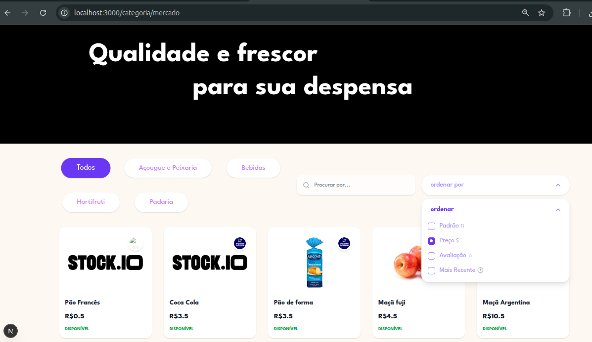

# Stock.io

Número da Lista: Grupo 2<br>
Conteúdo da Disciplina: Ordenação<br>

## 👥 Equipe - Grupo 2

Dupla responsavel pela implementação dos algoritmos de Ordenação
| Foto | Nome | Matricula |
|---:|---|---|
|  | **[Giovanna Felipe](https://github.com/giovannafg)** | 241038998 |
|  | **[André Henrique](https://github.com/andrehsb)** | 241025149 |

## Sobre 
Frontend do sistema de Catalogo de produtos e ecommerce, construído com Next.js (App Router) e TypeScript. 

## Links 
Link para repositório backend: https://github.com/eda2-2026/Busca_G2_back

Link para vídeo explicativo: https://youtu.be/wg7GRJDCees

## Screenshots


## Estruturas de dados implementadas para otimização
O projeto utiliza o algoritmo **Radix Sort** para otimizar a ordenação por **preço**, e **Merge Sort** para otimizar a ordenação por **avaliação**

A escolha do Radix Sort para a ordenação por preço justifica-se pela sua natureza não-comparativa, que permite alcançar uma complexidade de tempo linear $O(n \cdot k)$, superando o limite matemático de $O(n \log n)$ dos algoritmos convencionais ao tratar valores monetários como chaves numéricas de base decimal. 

Complementarmente, optou-se pelo Merge Sort para a ordenação por avaliações devido à sua estabilidade garantida; em um cenário de e-commerce, é fundamental que, ao ordenar produtos com a mesma nota média, a ordem cronológica ou alfabética anterior seja preservada, evitando reposicionamentos arbitrários na interface. 

Juntos, esses algoritmos asseguram que o sistema mantenha um alto desempenho no processamento de grandes volumes de dados, enquanto preserva a integridade visual e a previsibilidade dos filtros aplicados pelo usuário

### Onde as Ordenações são utilizadas:

1.  **Páginas de Categoria:** http://localhost:3000/categoria/{nomeCategoria}

Os Algoritmos de Ordenação foram utilizados no filtro de listagem.

## 🛠️ Tecnologias
| Categoria | Tecnologia |
|---|---|
| Framework | Next.js (App Router) |
| Linguagem | TypeScript |
| Estilização | Tailwind CSS |
| HTTP Client | Axios |

## 🚀 Instalação Rápida

```bash
# clonar
git clone <URL_DO_REPOSITORIO>
cd gorgonas-frontend

# instalar dependências
npm install
# ou
yarn install

#biblioteca utilizada
npm install lucide-react
```

## 🔒 Variáveis de Ambiente
Crie `.env.local` na raiz (mesmo nível do package.json):

```env
NEXT_PUBLIC_API_BASE_URL=http://localhost:3001
```


## ▶️ Scripts Úteis
```bash
npm run dev       # servidor de desenvolvimento (http://localhost:3000)

```

## Uso 
Ao acessar a aplicação, o usuário, ainda deslogado, será direcionado para a HomePage e terá acesso à todo o catálogo de produtos, categorias e lojas. 
Após efetuar o login o usuário pode navegar pelo seu perfil para adicionar uma loja, adicionar um produto e adicionar avaliações em outros produtos.